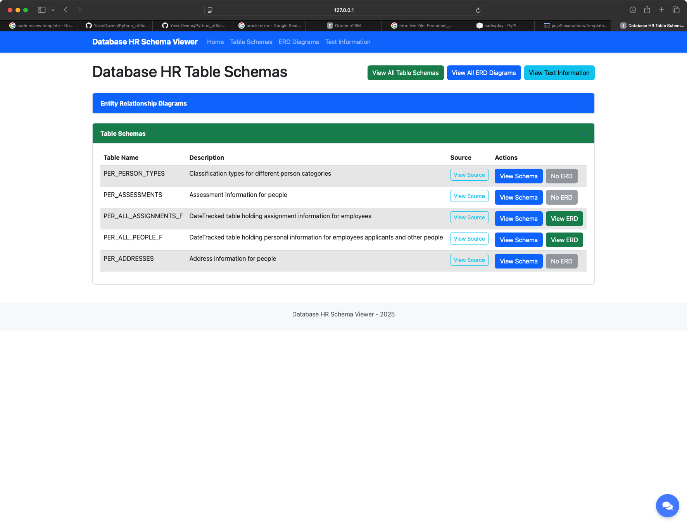
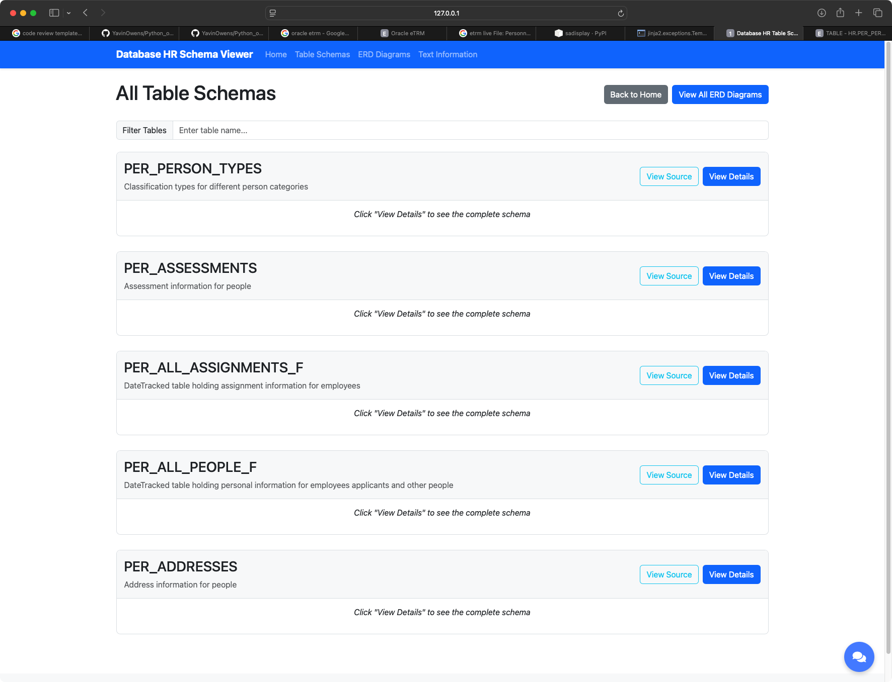

# Data Quality and Analytics Framework

## Executive Summary
This project represents a modern approach to data quality management and analytics, designed for scalable SaaS environments. It combines advanced data validation techniques with multi-engine analytics capabilities, enabling organizations to build robust data quality pipelines while maintaining flexibility across different data processing engines.

## Background
In the evolving landscape of data architecture, organizations face increasing challenges in maintaining data quality while scaling their analytical capabilities. This framework addresses these challenges by providing a unified approach to data validation and analysis across multiple processing engines (Pandas, Polars, and PySpark), making it suitable for both startup environments and enterprise-scale deployments.

## Project Structure

```
Python_offline/
├── main/
│   ├── helpers/           # Core utilities and database connections
│   │   ├── db_connection.py  # Database connectivity layer
│   │   └── sql_queries.py    # SQL query management
│   ├── data_validation_basics.py   # Data validation with Pandera
│   ├── data_validation_basics.ipynb
│   ├── pandas_basics.py            # Pandas implementation
│   ├── pandas_basics.ipynb
│   ├── polars_basics.py           # Polars (Rust-based) implementation
│   ├── polars_basics.ipynb
│   ├── pyspark_basics.py          # PySpark distributed computing
│   └── pyspark_basics.ipynb
└── requirements.txt      # Project dependencies
```

## Core Features

### Multi-Engine Analytics Support
- **Pandas**: Traditional data analysis with familiar Python interface
- **Polars**: High-performance Rust-based alternative for larger datasets
- **PySpark**: Distributed computing for big data workloads

### Advanced Data Validation
- Schema validation using Pandera
- Dynamic schema adaptation
- Custom validation rules
- Cross-database validation capabilities

### Database Integration
- PostgreSQL connectivity
- Dynamic table discovery
- Schema introspection
- Automated data quality assessment

## Setup Instructions

1. Create and activate a virtual environment:
   ```bash
   python -m venv .venv
   source .venv/bin/activate  # On Windows: .venv\Scripts\activate
   ```

2. Install dependencies:
   ```bash
   pip install -r requirements.txt
   ```

3. Configure database connection in `helpers/db_connection.py`

4. Start Jupyter Notebook:
   ```bash
   jupyter notebook
   ```

## Use Cases

### SaaS Development
- **Data Quality Gates**: Implement automated quality checks in CI/CD pipelines
- **Schema Evolution**: Track and validate schema changes across versions
- **Multi-tenancy Validation**: Ensure data integrity across tenant boundaries
- **Performance Optimization**: Choose the right engine for different data volumes

### Analytics Engineering
- **Data Profiling**: Automated analysis of data distributions and patterns
- **Quality Metrics**: Track and report on data quality over time
- **Cross-Engine Validation**: Compare results across different processing engines
- **Pipeline Validation**: Verify data transformation accuracy

### Enterprise Integration
- **Legacy System Integration**: Validate data from multiple source systems
- **Data Governance**: Implement and enforce data quality rules
- **Audit Trails**: Track data quality issues and resolutions
- **Scalability Testing**: Evaluate performance across different data volumes

## Best Practices

1. **Engine Selection**:
   - Use Pandas for small to medium datasets (<1GB)
   - Use Polars for larger datasets with single-machine processing
   - Use PySpark for distributed processing needs

2. **Validation Strategy**:
   - Implement both schema-level and semantic validations
   - Use custom validation rules for business logic
   - Monitor validation performance impact

3. **Development Workflow**:
   - Start with Jupyter notebooks for exploration
   - Convert stable code to Python modules
   - Implement automated testing for validations

## Future Enhancements
- Integration with dbt for transformation validation
- Support for additional databases and data formats
- Machine learning-based anomaly detection
- Real-time validation capabilities

## The Rise of Analytical Engineering

*A Glimpse into the Future*

As we stand at the intersection of data engineering and analytics, a profound transformation is occurring. This framework isn't just about data validation it's a blueprint for the semantic layer that will bridge the gap between raw data and business intelligence. 

Consider this: As our data systems grow more complex, they're beginning to exhibit emergent behaviors. The ability to dynamically adapt to schema changes, automatically validate data quality, and seamlessly switch between processing engines isn't just convenient it's becoming sentient in its own right.

The true power lies not in the individual components, but in their synthesis. When data validation becomes intelligent enough to understand context, when analytics engines can autonomously choose the most efficient processing path, we're no longer just building tools—we're creating an ecosystem that thinks for itself.

This framework is more than code; it's a step toward a future where data quality isn't maintained—it's inherent. Where analytics aren't just performed—they're understood. The rise of analytical engineering isn't just changing how we work with data; it's changing how data works with us.

*"In the end, we're not just validating data. We're teaching our systems to understand truth itself."*

---

# Oracle HR Tables Project

This repository contains two main components:

1. **PL/SQL Validation Scripts** - A suite of PL/SQL scripts for validating and standardizing Oracle HR table data
2. **HR Table Schema Scraper** - A Python tool for scraping Oracle HR table definitions and generating CSV documentation


## PL/SQL Validation Scripts

### Oracle HR Table Validation Scripts

1. **validations.sql** - Main validations for people table
2. **name_field_validation.sql** - Validations for name fields
3. **email_validation.sql** - Validations for email fields
4. **address_validation.sql** - Validations for address fields
5. **job_history_validation.sql** - Validations for job history
6. **national_insurance_validation.sql** - Validations for UK National Insurance numbers
7. **date_of_birth_validation.sql** - Validations for date of birth fields
8. **data_quality_review.sql** - Data quality review summary

### Execution Scripts

1. **executions.sql** - Master execution script that runs all validations in sequence

## HR Table Schema Scraper

A Python-based tool for scraping Oracle HR table definitions from web pages and generating structured CSV output.

### Requirements

- Python 3.9+ (currently using Python 3.9.18)
- Required packages:
  - requests
  - beautifulsoup4
  - pandas
  - lxml
  - flask (for web viewer)

### Setup

1. Set up a Python virtual environment:

   ```bash
   # Install the virtual environment
   pyenv install 3.9.18
   pyenv virtualenv 3.9.18 hr-schema-scraper
   pyenv local hr-schema-scraper
   
   # Install required packages
   pip install requests beautifulsoup4 pandas lxml flask
   ```

2. Configure the URLs to scrape:
   - Edit the `oracle_hr_urls.csv` file to add or modify table URLs

### Usage

1. Run the scraper:

   ```bash
   python oracle_table_scraper.py --urls oracle_hr_urls.csv --output oracle_tables
   ```

2. Run the web viewer to browse scraped schemas and ERD diagrams:

   ```bash
   python web_viewer.py
   ```

   Then open your browser to [http://localhost:5001](http://localhost:5001)

3. View ERD diagrams for tables:
   - Each table has an associated ERD button if a diagram is available
   - Diagrams are mapped to tables based on naming patterns and explicit mappings
   - You can also view all available ERD diagrams in the dedicated section on the home page

### Files and Directory Structure

```text
├── oracle_tables/              # Data directory for scraped tables
│   ├── tables/                # CSV files for each table
│   ├── text information/      # Metadata text files
│   └── erds/                  # ERD diagram files
├── templates/                 # Web viewer templates
├── resource/                  # Screenshots and resources
├── setup/                     # Setup and utility files
│   ├── config/                # Configuration files
│   ├── scraper/               # Scraper source files
│   └── data/                  # Data source files
├── web_viewer.py              # Main web application
└── README.md                  # This file
```

#### Key Files

- **web_viewer.py** - Flask web application for viewing scraped schemas and ERD diagrams
- **setup/scraper/oracle_table_scraper.py** - Main scraper script
- **setup/data/oracle_hr_urls.csv** - CSV file containing the URLs to scrape
- **setup/data/oracle_hr_erd.csv** - CSV file containing the URLs for ERD diagrams

## Usage Examples

### Running PL/SQL Validations

To run all validations:

```sql
@executions.sql
```

To run specific validations, use the relevant script and call the procedures:

```sql
-- Example for address validations
@address_validation.sql
EXEC create_address_clean_copy;
EXEC standardize_uk_counties;
EXEC validate_uk_postcodes;
```

## Application Screenshots

### Homepage


### Table Schemas Page



### Table Detail View


### ERD Diagrams Page


### Text Information View



## Features

- **Table Schema Viewer** - Browse all available tables with descriptions
- **ERD Diagram Viewer** - View entity relationship diagrams for Oracle HR tables
- **Text Information Viewer** - View metadata information for each table
- **Search Functionality** - Search across schemas and ERD diagrams
- **Consistent Navigation** - In-app chatbot for assistance available on all pages
- **Mobile-Friendly UI** - Responsive design that works on all device sizes

```sql
EXEC clean_address_spaces;
EXEC identify_incomplete_addresses;
```

### Scraping Oracle HR Tables

```bash
# Run the scraper with default settings
python oracle_table_scraper.py

# Run with custom URL file and output directory
python oracle_table_scraper.py --urls custom_urls.csv --output output_dir
```
